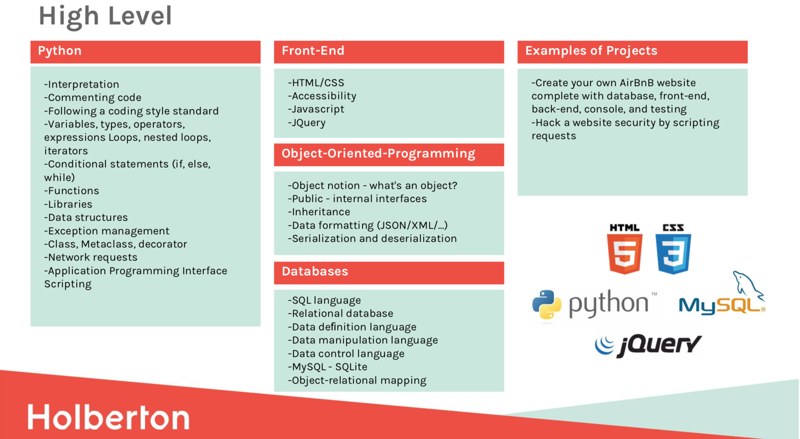

# Holberton Higher-Level Programming
---
This repository holds all of the assignments given as part of the higher-level programming section of the Holberton School curriculum.

---
## Author
Essence Boayue [Github](https://github.com/eboayue)|[LinkedIn](https://www.linkedin.com/in/essenceboayue/)|[Twitter](https://twitter.com/girlsaregeeks2)
